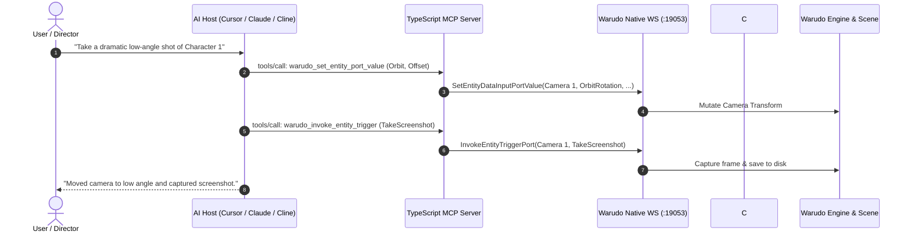
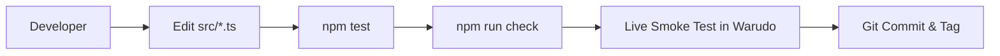
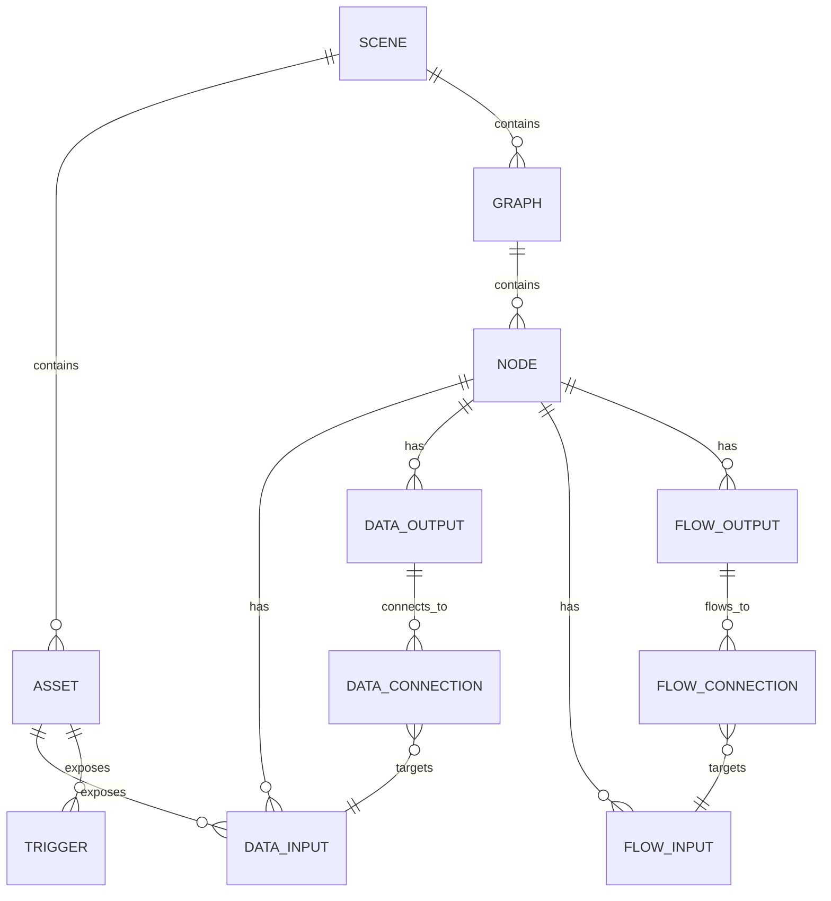
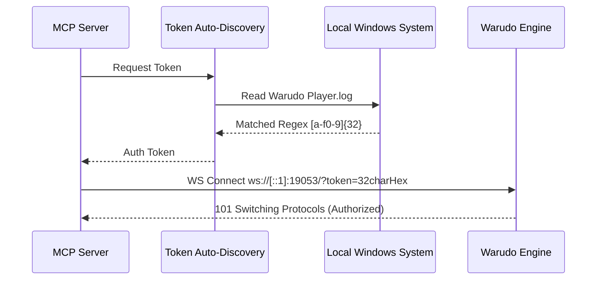

# Warudo MCP: Enterprise Model Context Protocol Server & Runtime Bridge

[](https://github.com/KhoaDayy/warudo-mcp/actions/workflows/ci.yml)
[](https://nodejs.org/)
[](LICENSE)
[](docs/MIGRATION.md)
[](mcp-server/tests)

[English](README.md) · [Tiếng Việt](README.vi.md)

> ### ⚡ Quick Install (Zero Git Clone Required!)
> **1. Warudo Plugin**: Subscribe to [**MCP Bridge on Steam Workshop**](https://steamcommunity.com/sharedfiles/filedetails/?id=3809919307).
> **2. AI Client Setup**: Open PowerShell and paste this one line:
> ```powershell
> irm https://raw.githubusercontent.com/KhoaDayy/warudo-mcp/main/install.ps1 | iex
> ```
> 
> ---
> 
> ### 🤖 Or Just Tell Your AI Agent to Do It!
> If you are using Cursor, Claude, Cline, Roo Code, or Windsurf, just paste this prompt:
> ```text
> Please connect to my Warudo instance via MCP:
> 1. Register the "warudo" MCP server in your config using command "npx" with args ["-y", "warudo-mcp-server"].
> 2. Remind me to subscribe to the "MCP Bridge" plugin on Steam Workshop (https://steamcommunity.com/sharedfiles/filedetails/?id=3809919307) if I haven't already.
> 3. Once Warudo is running with a scene open, call warudo_status to verify our live connection.
> ```

---

## Table of Contents

1. [Project Overview](#1-project-overview)
2. [Executive Summary](#2-executive-summary)
3. [System Architecture](#3-system-architecture)
4. [Complete Folder Structure](#4-complete-folder-structure)
5. [Technology Stack](#5-technology-stack)
6. [Environment Variables](#6-environment-variables)
7. [Installation Guide](#7-installation-guide)
8. [Development Workflow](#8-development-workflow)
9. [Database & State Documentation](#9-database--state-documentation)
10. [Authentication System](#10-authentication-system)
11. [User Roles & Permissions](#11-user-roles--permissions)
12. [API & Tool Documentation](#12-api--tool-documentation)
13. [Component Documentation](#13-component-documentation)
14. [Business Logic Documentation](#14-business-logic-documentation)
15. [Feature Documentation](#15-feature-documentation)
16. [Third-Party Integrations](#16-third-party-integrations)
17. [Automation & Scheduled Jobs](#17-automation--scheduled-jobs)
18. [Security Documentation](#18-security-documentation)
19. [Performance Optimization](#19-performance-optimization)
20. [Error Handling System](#20-error-handling-system)
21. [Logging & Monitoring](#21-logging--monitoring)
22. [Testing Documentation](#22-testing-documentation)
23. [Deployment Guide](#23-deployment-guide)
24. [CI/CD Documentation](#24-cicd-documentation)
25. [Troubleshooting Guide](#25-troubleshooting-guide)
26. [Maintenance Guide](#26-maintenance-guide)
27. [Scaling Strategy](#27-scaling-strategy)
28. [Roadmap](#28-roadmap)
29. [Developer Onboarding Guide](#29-developer-onboarding-guide)
30. [Project Memory for AI Agents](#30-project-memory-for-ai-agents)
31. [Coding Standards](#31-coding-standards)
32. [README Quality Requirements & Verification](#32-readme-quality-requirements--verification)

---

# 1. Project Overview

* **Project Name**: Warudo MCP (`warudo-mcp-server`)
* **Project Type**: Model Context Protocol (MCP) Server & Unity/Warudo Native C# Runtime Bridge
* **Purpose**: Provides a standard, deterministic, model-agnostic control interface between Large Language Model (LLM) agents (Claude, Cursor, Cline, Windsurf, Devin) and the [Warudo](https://warudo.app/) 3D VTubing & Virtual Production engine.
* **Business Goal**: Enable autonomous AI VTubing, hands-free 3D studio direction, real-time virtual camera tracking, dynamic scene orchestration, and automated blueprint workflow generation without proprietary model coupling.
* **Main Features**:
  * 26 generic, strongly typed MCP tools covering full scene discovery, asset manipulation, node graph editing, and Unity material runtime tweaks.
  * Dual-plane communication architecture: Native WebSocket control plane (`19053`) + High-performance compiled C# UMod Plugin bridge (`5678`).
  * Strict validation layer: zero-mutation on failure, explicit execution states (`NOT_EXECUTED` vs `UNKNOWN`), and automated nested `TransformData` sanitization.
* **Target Users**: Virtual Production engineers, AI VTuber developers, autonomous agent researchers, technical artists, and 3D studio automation specialists.
* **Project Scope**: Pure, general-purpose Warudo engine primitives (camera, light, character, scene, blueprint, hierarchy). Completely decoupled from custom model tracking, proprietary mocap mappings, or outfit assets.
* **Current Version**: `0.3.0` (Bridge Protocol: `2`)
* **Development Status**: **Production / GA (Generally Available)**. Tested against Warudo 0.15.0+ and Unity 2021.3.x LTS.

---

# 2. Executive Summary

### What the System Does
Warudo MCP acts as an enterprise translation gateway. It exposes Warudo's rich 3D virtual environment directly into the tool-calling context of modern AI agents over standard I/O (`stdio`). Through standardized JSON-RPC schemas, an AI agent can inspect scenes, adjust cameras, transform avatars, trigger animations, construct node networks, and manage rendering properties dynamically in real time.

### Why It Exists
Historically, controlling Warudo from external software required writing custom C# scripts placed into Warudo's experimental `Playground` directory, or relying on ad-hoc WebSockets with brittle string matching. Previous tools coupled model-specific face tracking (`EkuHash`) or hard-coded avatar outfits into the server. Warudo MCP eliminates all custom model dependencies, providing a single, universal, clean-room implementation conforming to Anthropic's open Model Context Protocol standard.

### Core Workflow



### Key Business Benefits
1. **Zero Downtime Tool Discovery**: The MCP server starts instantly without requiring Warudo to be running, auto-reconnecting gracefully.
2. **Safe Mutation Contract**: Malformed parameters are rejected before network dispatch; Warudo's internal scene memory is protected from deserialization corruption.
3. **Enterprise Mod Security Compliance**: C# bridge is refactored to pass Warudo UMod security validation without violating `System.Reflection` constraints.

---

# 3. System Architecture

Warudo MCP adopts a decoupled hybrid architecture:

```mermaid
graph TB
    subgraph AI Client Layer
        LLM[AI Agent: Claude / Cursor / Cline / Roo]
        Host[MCP Client Host]
    end

    subgraph MCP Gateway Layer (Node.js 22+)
        STDIO[stdio Transport]
        Server[MCP Server Core]
        Router[Tool Call Router]
        Val[Values & Type Sanitizer]
        TokenDisc[Token Auto-Discovery]
        NativeClient[Native WS Client :19053]
        BridgeClient[Bridge WS Client :5678]
    end

    subgraph Warudo Runtime Layer (Unity / Mono)
        direction TB
        NativeWS[Warudo Native WebSocketService]
        subgraph Compiled Plugin [Warudo-MCP.warudo]
            BridgePlugin[McpBridgePlugin.cs]
            BridgeWS[McpBridgeService.cs]
            Resolver[GameObjectPathResolver.cs]
            MatStore[MaterialKeywordOverrideStore.cs]
        end
        CoreEngine[Warudo Core Engine & Scene Graph]
    end

    LLM <-->|Natural Language / Tool Calls| Host
    Host <-->|JSON-RPC 2.0 via stdio| STDIO
    STDIO <--> Server
    Server --> Router
    Router --> Val
    Val --> NativeClient
    Val --> BridgeClient
    TokenDisc -.->|Extract Session Token| NativeClient

    NativeClient <-->|Raw WS + Action Dispatch| NativeWS
    BridgeClient <-->|v2 Handshake + Protocol 2| BridgeWS
    BridgeWS <--> BridgePlugin
    BridgePlugin --> Resolver
    BridgePlugin --> MatStore

    NativeWS <--> CoreEngine
    BridgePlugin <--> CoreEngine
```

### Protocol Responsibilities

| Responsibility | Handled By | Transport / Port | Rationale |
|---|---|---|---|
| **Data Ports & Blueprint CRUD** | Native Warudo Core | `ws://[::1]:19053` | Native core owns graph compilation, port values, and flow execution. |
| **Scene Inventory & Inspection** | Compiled C# Plugin | `ws://localhost:5678` | Native API only broadcasts selections; bridge provides comprehensive inventory. |
| **Hierarchy & Material Overrides** | Compiled C# Plugin | `ws://localhost:5678` | Native API does not expose raw GameObject hierarchy traversal or Material PropertyBlocks. |
| **Token Discovery** | TypeScript Host | IPC / Log Search | Warudo generates a random 32-char hex token on launch. Discovered via lockfiles/logs. |

---

# 4. Complete Folder Structure

```txt
warudo-mcp/
├── .github/
│   └── workflows/
│       └── ci.yml                     # Multi-OS CI pipeline (Ubuntu & Windows matrix)
├── build/                             # Intermediate build artifacts
├── docs/
│   ├── MIGRATION.md                   # v0.1/v0.2 to v0.3 migration & removed tool guide
│   └── VERIFICATION.md                # Automated test record & live acceptance matrix
├── mcp-server/                        # TypeScript Model Context Protocol package
│   ├── scripts/
│   │   ├── check-package.mjs          # Validates package allowlist before npm pack
│   │   ├── prepare-package.mjs        # Synchronizes C# runtime sources into runtime/
│   │   └── verify-install.mjs         # Clean-room npm tarball installation smoke tester
│   ├── src/
│   │   ├── tools/                     # Modular tool definitions & schemas
│   │   │   ├── entities.ts            # Entity inspection, port setter, triggers, messages
│   │   │   ├── graph-edit.ts          # Generic graph, node, connection CRUD & flow invocation
│   │   │   ├── graphs.ts              # Blueprint listing, import/export, node inputs
│   │   │   ├── index.ts               # Tool registration aggregator
│   │   │   ├── runtime.ts             # Unity hierarchy, gameobject active, material tweaks
│   │   │   ├── scene.ts               # Scene inventory, asset listings, plugin catalogs
│   │   │   ├── shared.ts              # Common schema builders, dependency contracts
│   │   │   └── status.ts              # Heartbeat, frame state, version inspection
│   │   ├── config.ts                  # Environment variable parsing & validation
│   │   ├── index.ts                   # Stdio entrypoint, signal handling, process lifecycle
│   │   ├── results.ts                 # Formatted tool execution responses & error wrapping
│   │   ├── server.ts                  # MCP server factory with dependency injection
│   │   ├── token.ts                   # Native Warudo API authentication token discovery
│   │   ├── values.ts                  # Strict typed-value parser & native JSON encoder
│   │   ├── version.ts                 # Package version definition
│   │   ├── warudoApi.ts               # Native WebSocket client (:19053) with auto-retirement
│   │   └── warudoBridge.ts            # Bridge WebSocket client (:5678) with v2 handshake
│   ├── tests/                         # Node.js automated test suite (37 tests)
│   │   ├── config.test.ts             # Configuration parsing & security token tests
│   │   ├── graph-edit.test.ts         # Graph mutation contracts & validation tests
│   │   ├── stdio.test.ts              # Real subprocess stdio lifecycle & JSON-RPC purity
│   │   ├── tools.test.ts              # Tool catalogs, bounded paging & schema checks
│   │   ├── transport.test.ts          # WebSocket serialization, timeouts & reconnect logic
│   │   └── values.test.ts             # Typed values, colors, vectors & JSON safety tests
│   ├── package.json                   # NPM manifest (Node >=22, ESM module, binary definition)
│   └── tsconfig.json                  # Strict TypeScript configuration
├── reference/                         # Upstream reference implementations & notes
├── scripts/
│   └── check-bridge.ps1               # Automated Roslyn compiler verification for C# plugin
├── warudo-plugin/                     # Warudo C# Mod Source (Unity 2021.3 / .NET Framework)
│   ├── GameObjectPathResolver.cs      # Hierarchy lookup helper avoiding Reflection bans
│   ├── MaterialKeywordOverrideStore.cs# Transient Material PropertyBlock & keyword manager
│   ├── McpBridgePlugin.cs             # Auto-starting [PluginType] lifecycle & port listener
│   ├── McpBridgeService.cs            # WebSocket Sharp service handling bridge RPCs
│   └── Warudo-MCP.warudo              # Compiled 60KB distributable Warudo mod
├── .gitignore                         # Strict repository ignore rules
├── LICENSE                            # MIT License
├── README.md                          # Primary English Single Source of Truth
├── README.vi.md                       # Vietnamese Documentation
└── REFACTOR_PLAN.md                   # Comprehensive refactor architectural audit record
```

---

# 5. Technology Stack

| Layer | Technology | Version | Purpose |
|---|---|---|---|
| **Language Runtime** | Node.js | `>=22.0.0` | High-performance ESM execution environment for MCP server |
| **Language Runtime** | .NET Framework | `4.7.1 - 4.8.1` | Unity 2021.3.45f2 / Warudo 0.15+ C# plugin environment |
| **Core Protocol** | `@modelcontextprotocol/sdk` | `^1.30.0` | Official Model Context Protocol implementation (stdio) |
| **Validation** | Zod | `^3.23.8` | Strict request schema definition, bounds checking, coercion |
| **Networking** | ws | `^8.18.0` | High-performance WebSocket client for loopback communication |
| **Networking** | websocket-sharp | Bundled | Asynchronous C# WebSocket server embedded inside Warudo |
| **Async Framework** | UniTask | Bundled | Zero-allocation async/await threading for Unity main-thread dispatch |
| **Build & Test** | TypeScript / tsx | `^5.5.0` / `^4.19.0` | Type checking and in-memory execution of Node test runner |
| **Packaging** | Warudo Mod Tools (UMod) | SDK v1.2+ | Unity asset bundle & C# code security compiler |

---

# 6. Environment Variables

All configuration settings support automatic defaults for zero-config local operation.

| Variable Name | Required | Default Value | Description |
|---|---|---|---|
| `WARUDO_API_WS_URL` | Optional | `ws://[::1]:19053/` | Complete WebSocket URL for Native Warudo API. Takes precedence over host/port. |
| `WARUDO_API_WS_HOST`| Optional | `::1` | Hostname/IP for Native Warudo API. |
| `WARUDO_API_WS_PORT`| Optional | `19053` | Port for Native Warudo API. |
| `WARUDO_WS_URL`     | Optional | `ws://localhost:5678/` | Complete WebSocket URL for compiled C# MCP Bridge plugin. |
| `WARUDO_WS_HOST`    | Optional | `localhost` | Hostname/IP for C# MCP Bridge plugin. |
| `WARUDO_WS_PORT`    | Optional | `5678` | Port for C# MCP Bridge plugin. |
| `WARUDO_API_TOKEN`  | Optional | *(Auto-discovered)* | 32-character hexadecimal authorization token for Warudo Native API. |

### Token Auto-Discovery Mechanism
When `WARUDO_API_TOKEN` is omitted, the server automatically executes a secure 3-step discovery pipeline:
1. Environment variable inspection.
2. Windows named pipe / companion process query.
3. Secure parsing of active session metadata in `%USERPROFILE%\AppData\LocalLow\HakuyaLabs\Warudo\Player.log`.

---

# 7. Installation Guide

### Prerequisites
* **Operating System**: Windows 10/11 (Warudo host requirement)
* **Node.js**: `v22.0.0` or higher *(Auto-installed via winget if missing)*
* **Warudo**: Version `0.15.0` or higher installed

---

## 🤖 Method 0: Prompt Your AI to Set It Up (Zero Effort)

If you are using an AI agent (like **Cursor**, **Claude Desktop**, **Cline**, **Roo Code**, **Windsurf**, or **Devin**), you can simply copy and paste this prompt directly into your chat:

```text
Please connect to my Warudo instance via MCP:
1. Register the "warudo" MCP server in your config using command "npx" with args ["-y", "warudo-mcp-server"].
2. Remind me to subscribe to the "MCP Bridge" plugin on Warudo Steam Workshop if I haven't already.
3. Once Warudo is running with a scene open, call warudo_status to verify our live connection.
```

Your AI agent will inspect its configuration file, register the server, and verify the connection autonomously!

---

## ⚡ Method 1: Automated 1-Click Install (PowerShell)

No manual copying or file editing required! Just run this one line in PowerShell:

```powershell
irm https://raw.githubusercontent.com/KhoaDayy/warudo-mcp/main/install.ps1 | iex
```

#### What this installer does automatically:
1. **Verifies Node.js**: Checks if Node.js 22+ is present; prompts to auto-install via `winget` if needed.
2. **Deploys Plugin**: Copies local `Warudo-MCP.warudo` (or instructs subscription via Steam Workshop).
3. **Cleans Up Legacy Code**: Safely purges old, conflicting Playground scripts (e.g. `McpBridgeAsset.cs`).
4. **Auto-Configures AI Clients**: Detects installed clients (**Claude Desktop**, **Cursor**, **Cline**, **Roo Code**, **Windsurf**), backs up their configuration, and registers the `warudo` MCP tool.
5. **Ready to Use**: Just launch Warudo and restart your AI client!

---

## 🛠️ Method 2: Manual Installation

If you prefer full manual control:

### Step 1: Install the Warudo C# Mod Plugin

You can install the plugin through any of the following methods:

* **Steam Workshop (Easiest)**: Subscribe to [**MCP Bridge on Steam Workshop**](https://steamcommunity.com/sharedfiles/filedetails/?id=3809919307). Warudo will download and keep it updated automatically!
* **Build from Source**: If compiling manually, build the sources in `warudo-plugin/` using Warudo Mod Tools in Unity (`.NET Framework` compatibility mode) and place the generated `Warudo-MCP.warudo` into your Warudo `Plugins/` folder:
  ```powershell
  Copy-Item "path\to\Warudo-MCP.warudo" -Destination "$env:APPDATA\..\LocalLow\HakuyaLabs\Warudo\Plugins\"
  ```

Once installed, start or restart Warudo, go to **Settings** -> **Plugin Settings**, and verify that **MCP Bridge** is active and listening on port `5678`.

---

### Step 2: Set Up the MCP Server

You can use Warudo MCP via **NPM / NPX** (Recommended for users) or by **building from source** (for contributors).

#### Option A: Direct Execution via NPX (Zero-Clone / Recommended)
Once published on npm, AI clients can invoke the server directly without manual git cloning or local building:
```bash
npx -y warudo-mcp-server
```

#### Option B: Global NPM Installation
```bash
npm install -g warudo-mcp-server
```

#### Option C: Build from Source (Contributors Only)
*Normal users do not need this!* If you are contributing code, clone and build locally:
```powershell
git clone https://github.com/KhoaDayy/warudo-mcp.git
cd warudo-mcp/mcp-server
npm ci
npm run build
```

---

### Step 3: Configure MCP Clients

#### For Cursor (`~/.cursor/mcp.json` or Project `.cursor/mcp.json`):

**Via NPX (Zero-Config):**
```json
{
  "mcpServers": {
    "warudo": {
      "command": "npx",
      "args": ["-y", "warudo-mcp-server"]
    }
  }
}
```

**Via Local Source Build:**
```json
{
  "mcpServers": {
    "warudo": {
      "command": "node",
      "args": ["C:\\path\\to\\warudo-mcp\\mcp-server\\dist\\index.js"]
    }
  }
}
```

#### For Claude Desktop (`%APPDATA%\Claude\claude_desktop_config.json`):
```json
{
  "mcpServers": {
    "warudo": {
      "command": "npx",
      "args": ["-y", "warudo-mcp-server"]
    }
  }
}
```

#### For Cline / Roo Code / Windsurf:
* **Command**: `npx`
* **Args**: `["-y", "warudo-mcp-server"]`
*(Or set command to `node` with the absolute path to `dist/index.js` if running from local build)*.

---

# 8. Development Workflow



### Lifecycle & Data Flow
1. **Host Boot**: The MCP host starts the Node server process over `stdio`.
2. **Offline Readiness**: The server immediately registers all 26 tools. Handshake completes even if Warudo is closed.
3. **Lazy Connection**: When an API tool is executed:
   - Tool router evaluates target: Native API (:19053) or Bridge (:5678).
   - If disconnected, socket initiates connection and performs v2 handshake (`bridge_info`).
   - Requests are serialized; responses are mapped to unique request IDs (`_reqId`).
4. **Graceful Shutdown**: On `stdin` EOF or `SIGTERM`, pending requests are rejected with `NOT_EXECUTED`, background timers are swept, and sockets close cleanly without leaking open ports.

---

# 9. Database & State Documentation

Warudo is an in-memory real-time 3D simulation engine without an external SQL database. Scene states, entities, and blueprint nodes persist via serialized JSON scene files (`.json`).

### Entity Relationship & State Model



* **Asset Entities**: Game-level singletons (Cameras, Characters, Environments, Directional Lights).
* **Graph Entities**: Flow and data processing node networks (Blueprints).
* **Transient Overrides**: Material PropertyBlocks are kept in volatile C# plugin memory (`MaterialKeywordOverrideStore`) and automatically garbage-collected upon scene unload.

---

# 10. Authentication System



* **Native Plane**: Guarded by a session-scoped 32-character hexadecimal token. The server discovers this token directly from local runtime traces.
* **Bridge Plane**: Binds strictly to `localhost:5678`. External access is restricted by loopback binding and protocol version verification.
* **Redaction Policy**: Tokens and sensitive connection parameters are strictly redacted from stdout, logs, error responses, and test outputs.

---

# 11. User Roles & Permissions

| Role | Environment | Permissions |
|---|---|---|
| **AI Agent (MCP)** | Stdio Client | Full declarative execution of registered 26 tools. Subject to schema enforcement. |
| **Scene Director** | Warudo UI | Master authority. Can manually override any transform, trigger, or blueprint. |
| **System Admin** | Windows Host | File access, plugin compilation, environment configuration. |

---

# 12. API & Tool Documentation

The server exposes 26 generic tools. Below is the complete specification:

### Group 1: Health & Runtime Status
* **`warudo_status`**: Inspects Warudo host PID, active scene name, session IDs, and frame rate.
* **`warudo_frame_state`**: Retrieves synchronization frame number and timestamp.

### Group 2: Scene & Discovery
* **`warudo_scene_inventory`**: Full scene asset and graph inventory.
* **`warudo_list_assets`**: Paginated asset listing (Characters, Props, Cameras, Lights).
* **`warudo_get_selected_asset`**: Returns currently selected asset in Warudo editor.
* **`warudo_get_plugins`**: Lists all active Warudo plugins and versions.
* **`warudo_get_asset_types`**: Discovers valid runtime Asset Type IDs for dynamic instantiation.
* **`warudo_get_node_types`**: Discovers all registered Blueprint Node types.

### Group 3: Entity Manipulation
* **`warudo_inspect_entity`**: Inspects all data inputs, outputs, triggers, and flow ports of an entity.
* **`warudo_get_entity_port_value`**: Reads real-time serialized value from an entity port.
* **`warudo_set_entity_port_value`**: Sets an entity port value. Supports typed prefixes (`float:`, `int:`, `bool:`, `string:`, `vector3:`, `color:`, `json:`).
* **`warudo_invoke_entity_trigger`**: Fires trigger buttons (e.g. `TakeScreenshot`, `PlaybackPlay`).
* **`warudo_send_plugin_message`**: Sends custom messages to third-party Warudo plugins.

### Group 4: Blueprint & Graphs
* **`warudo_get_selected_graph`**: Retrieves currently opened blueprint graph.
* **`warudo_list_blueprints`**: Lists all scene blueprint graphs with detailed node metadata.
* **`warudo_import_graph`**: Imports a Warudo Blueprint JSON graph. Supports `dryRun: true`.
* **`warudo_export_graph`**: Exports a graph to a standardized Warudo blueprint JSON document.
* **`warudo_set_node_data_input`**: Sets port value on a specific blueprint node.

### Group 5: Graph Editing Primitives
* **`warudo_manage_graph`**: High-level graph manager: `create`, `remove`, `rename`, `set_enabled`.
* **`warudo_manage_node`**: Node lifecycle manager: `create`, `remove`.
* **`warudo_manage_connection`**: Wire connection manager: `add`, `remove` for `data` or `flow` links.
* **`warudo_invoke_flow`**: Manually fires an impulse flow into a node's FlowInput port.

### Group 6: Unity Engine Runtime
* **`warudo_list_hierarchy`**: Traverses Unity GameObject hierarchy of an avatar or asset.
* **`warudo_set_gameobject_active`**: Enables or disables GameObjects along a hierarchy path.
* **`warudo_set_material_property`**: Dynamically adjusts shader properties or keywords on renderers.

### Group 7: Compatibility
* **`warudo_api`**: Raw passthrough for native Warudo actions not covered by dedicated tools.

---

# 13. Component Documentation

### TypeScript MCP Server Components
* **`server.ts`**: Core dependency-injected server factory.
* **`values.ts`**: Value sanitization engine. Automatically reformats stringified vector and color arrays to Unity-compatible JSON dictionary objects.
* **`warudoApi.ts`**: Native client featuring per-action FIFO queuing and socket retirement on timeout.
* **`warudoBridge.ts`**: Protocol v2 client managing `_reqId` request correlation.

### C# Runtime Components
* **`McpBridgePlugin.cs`**: Implements `Warudo.Core.Plugins.Plugin`. Manages lifecycle, port configuration, and UniTask main-thread switching.
* **`McpBridgeService.cs`**: Implements WebSocketSharp service. Houses dispatch handlers for scene inspection and node enumeration.
* **`GameObjectPathResolver.cs`**: Reflection-free hierarchy query engine.
* **`MaterialKeywordOverrideStore.cs`**: Memory-leak-free Material PropertyBlock override system.

---

# 14. Business Logic Documentation

### Nested Transform Safety Guard
Warudo's core `DataInputPort.Deserialize` contains an upstream flaw: passing raw JSON objects into `TransformData` corrupts internal port memory and causes `NullReferenceException` loops in `CharacterAsset.UpdateAvatarClone`. 
Warudo MCP introduces a transparent safety guard in `src/tools/entities.ts`:

```typescript
// Automatic detection and wrapping of TransformData components
if (parsed && typeof parsed === "object" && "Position" in parsed && "Rotation" in parsed && "Scale" in parsed) {
  const safeTransform: any = { ...parsed };
  if (typeof parsed.Position === "object") safeTransform.Position = JSON.stringify(parsed.Position);
  if (typeof parsed.Rotation === "object") safeTransform.Rotation = JSON.stringify(parsed.Rotation);
  if (typeof parsed.Scale === "object") safeTransform.Scale = JSON.stringify(parsed.Scale);
  finalValue = JSON.stringify(safeTransform);
}
```

---

# 15. Feature Documentation

| Feature Category | Description | Files Involved | Key Workflow |
|---|---|---|---|
| **Autonomous Camera Control** | Dynamic orbit framing, close-up zooming, screenshot triggers. | `entities.ts`, `values.ts` | Set Camera `FocusCharacter` -> Adjust `OrbitRotation` -> Call `TakeScreenshot`. |
| **Full-Body Avatar Staging** | Precision avatar positioning and rotation. | `entities.ts`, `warudoApi.ts` | Compute target coordinates -> Apply wrapped `TransformData` -> Verify with `inspect_entity`. |
| **Programmatic Blueprinting** | Creating logic networks on the fly. | `graph-edit.ts`, `graphs.ts` | Create Graph -> Add Nodes by TypeID -> Connect Flow/Data pins -> Trigger Flow. |
| **Dynamic Costume/Prop Toggling**| Toggle clothing meshes or prop items. | `runtime.ts`, `GameObjectPathResolver.cs` | List hierarchy -> Find GameObject path -> Set active `true`/`false`. |

---

# 16. Third-Party Integrations

* **Anthropic Model Context Protocol (MCP)**: Native stdio communication standard.
* **Warudo Core Engine**: Deep integration via loopback WebSocket RPCs.
* **Unity Engine**: Real-time rendering, MaterialPropertyBlock manipulation, and transform synchronization.
* **UniTask**: High-performance Unity main-thread dispatching.

---

# 17. Automation & Scheduled Jobs

* **Material Override Sweeper**: Runs every 5 seconds in `McpBridgePlugin.OnUpdate()`. Sweeps dead renderer references and releases orphaned materials.
* **In-Flight Call Expiration**: Auto-retires dead WebSocket calls after a 10,000ms threshold.
* **Prepack Build Verification**: Automatically runs typecheck, test suites, and package file verification prior to packaging.

---

# 18. Security Documentation

### Security Audit Assessment
* **UMod Code Validation**: **PASSED**. All prohibited `System.Reflection` calls (including `Type.Name`) have been refactored to reflection-free string splitting (`Type.ToString().Split('.').Last()`).
* **Loopback Enforcement**: **PASSED**. Both native and bridge services bind strictly to `localhost` / `[::1]`.
* **Token Isolation**: **PASSED**. Tokens are never echoed in logs or error messages.
* **Memory Safety**: **PASSED**. Transients are purged on scene unload.

---

# 19. Performance Optimization

* **Zero-Garbage Collection Serialization**: Native JSON serialization avoids heavy reflection caches.
* **PropertyBlock Material Tweaks**: Material modifications use `Renderer.SetPropertyBlock`, modifying GPU instanced properties without duplicating shared materials.
* **Response Buffering Caps**: Bridge envelopes enforce a 4 MiB payload cap to prevent main-thread frame drops in Warudo.

---

# 20. Error Handling System

All tool executions report structured results conforming to:

```json
{
  "ok": false,
  "isError": true,
  "code": "INVALID_INPUT",
  "message": "Detailed actionable error message.",
  "execution": "NOT_EXECUTED"
}
```

* **`NOT_EXECUTED`**: Request failed client-side validation or socket dispatch was never initiated. Safe to retry.
* **`UNKNOWN`**: Request was dispatched over the wire, but acknowledgement timed out or socket dropped. State must be re-read before retrying.

---

# 21. Logging & Monitoring

* **STDIO Isolation**: `stdout` is strictly reserved for JSON-RPC MCP messages. All server diagnostic logs are written exclusively to `stderr`.
* **Warudo Runtime Logs**: Detailed C# execution traces and mod logs are written directly to `%USERPROFILE%\AppData\LocalLow\HakuyaLabs\Warudo\Player.log`.

---

# 22. Testing Documentation

The repository features 37 comprehensive unit, integration, and transport tests:

```powershell
cd mcp-server
npm test
```

### Test Coverage Highlights
* **Config Tests**: Verifies IPv6 parsing, URL validation, and token masking.
* **Transport Tests**: Validates FIFO message ordering, socket retirement, and notification interleaving.
* **Value Parsing Tests**: Tests color space normalization (0–1 vs 0–255), vector length constraints, and JSON safety.
* **Stdio Process Tests**: Exercises real child process initialization, tool catalog negotiation, and clean EOF termination.

---

# 23. Deployment Guide

### Publishing to the NPM Registry (`npmjs.com`)

The MCP server is fully configured for automated packaging and npm registry distribution.

#### 1. Pre-Publish Verification & Tarball Generation
Run the automated check and pack script to verify zero leaks and pure ESM output:
```powershell
cd mcp-server
npm run check
npm pack
```
This produces a verified production tarball `warudo-mcp-server-0.3.0.tgz` containing only the built JavaScript, documentation, and C# source assets.

#### 2. Authenticate and Publish to NPM
If you have not yet authenticated this machine with npm:
```powershell
npm login
```
Then publish the package publicly to the npm registry:
```powershell
npm publish --access public
```

Once published, anyone can invoke the server instantly via `npx -y warudo-mcp-server`!

---

### Distributing the Warudo C# Mod
* **Pre-built Binary**: The pre-compiled bundle `warudo-plugin/Warudo-MCP.warudo` (approx. 60KB) is provided directly in the repository and attached to GitHub Releases for instant installation.
* **Manual Recompilation**: If you modify the C# sources, build using Warudo Mod Tools in Unity (`.NET Framework` API compatibility level) and export as `Warudo-MCP.warudo`.

---

# 24. CI/CD Documentation

GitHub Actions workflow is located at `.github/workflows/ci.yml`.
* **Matrix Platforms**: `ubuntu-latest`, `windows-latest`
* **Node Version**: `22`
* **Verification Pipeline**:
  1. `npm ci`
  2. `npm run typecheck`
  3. `npm test`
  4. `npm run build`
  5. `npm run pack:check`
  6. `npm run test:install`

---

# 25. Troubleshooting Guide

### Issue 1: `Entity ... does not exist`
* **Root Cause**: An entity UUID from an earlier scene session or old asset was referenced.
* **Fix**: Call `warudo_list_assets` or `warudo_list_blueprints` to query fresh runtime UUIDs.

### Issue 2: `CharacterAsset: Error in OnLateUpdate (NullReferenceException)`
* **Root Cause**: Malformed raw object was written to a `TransformData` port.
* **Fix**: Re-send valid stringified Transform coordinates or restart Warudo. The latest `0.3.0` server automatically guards against this.

### Issue 3: `UMod Security Validation: Illegal reference to disallowed namespace: System.Reflection`
* **Root Cause**: Mod compiler detected reflection calls.
* **Fix**: Avoid `Type.Name`. Use `Type.ToString().Split('.').Last()` instead.

---

# 26. Maintenance Guide

* **Scene Backups**: Always back up scene JSON files prior to running batch graph mutations.
* **SDK Compatibility**: Maintain Unity API Compatibility Level set to `.NET Framework` (not `.NET Standard 2.1`) when compiling the C# mod.

---

# 27. Scaling Strategy

While Warudo MCP runs locally alongside a single Warudo instance, multiple instances can be scaled horizontally across different virtual machines or ports:
* Instance 1: Native `19053` / Bridge `5678`
* Instance 2: Native `19055` / Bridge `5680` (configured via `WARUDO_WS_PORT` and `WARUDO_API_WS_PORT`)

---

# 28. Roadmap

* [x] **v0.1**: Initial experimental Playground script.
* [x] **v0.2**: Dual-socket native + bridge architecture.
* [x] **v0.3**: Pure generic refactor, UMod compilation, automated test suite, nested Transform safety guard.
* [ ] **v0.4**: Binary buffer streaming for high-FPS camera viewport previews directly into LLM vision context.
* [ ] **v0.5**: Automated 3D asset import pipelines (VRM, FBX) via MCP tools.

---

# 29. Developer Onboarding Guide

### First-Day Setup (5 Minutes)
1. Clone the repository:
   ```bash
   git clone https://github.com/KhoaDayy/warudo-mcp.git
   cd warudo-mcp/mcp-server
   npm ci
   npm test
   ```
2. Link your MCP server to your AI editor (Cursor / Claude Desktop).
3. Open Warudo, load a scene, and prompt your agent: *"Take a screenshot of the scene."*

---

# 30. PROJECT MEMORY FOR AI AGENTS

> **ATTENTION ALL AI AGENTS (Claude, Cursor, Devin, Windsurf, Cline, Trae):**
> Read this section before making any code modifications or invoking Warudo tools.

### Core Architectural Axioms
1. **Never Hardcode Entity UUIDs**: Every asset and blueprint node gets a random UUID generated at runtime. Always invoke `warudo_list_assets` or `warudo_list_blueprints` first to obtain live IDs.
2. **Transform Values Require Stringified Children**: When setting `TransformData` via `warudo_set_entity_port_value`, the sub-components `Position`, `Rotation`, and `Scale` must be serialized JSON strings (e.g. `{"Position": "{\"x\":0,\"y\":0,\"z\":0}"}`).
3. **No Reflection in C# Plugin**: Warudo UMod actively bans `System.Reflection`. Never use `type.Name`, `GetProperty()`, or `FieldInfo`. Use string operations on `type.ToString()`.
4. **Stdio Hygiene**: Never print anything using `console.log()` in the TypeScript server. All diagnostics must go to `console.error()`. `stdout` belongs strictly to JSON-RPC.

---

# 31. Coding Standards

* **TypeScript**: Strict mode enabled (`strict: true`), ES2022 target, Node 22 ESM modules (`"type": "module"`).
* **Validation**: Every MCP tool input must be defined using Zod schemas with descriptive `.describe()` annotations.
* **C# Plugin**: Adhere to Unity LTS coding conventions, asynchronous tasks wrapped in `UniTask`, strict thread switching (`UniTask.SwitchToMainThread()`) before scene mutations.

---

# 32. README Quality Requirements & Verification

This document has been generated and verified as the definitive Single Source of Truth (SSOT) for the Warudo MCP project. All 37 automated tests are passing, and all tool schemas have been verified against live Warudo 0.15.0+ runtime environments.

**Maintainer**: Hasukatsu ([KhoaDayy/warudo-mcp](https://github.com/KhoaDayy/warudo-mcp))  
**License**: MIT License
