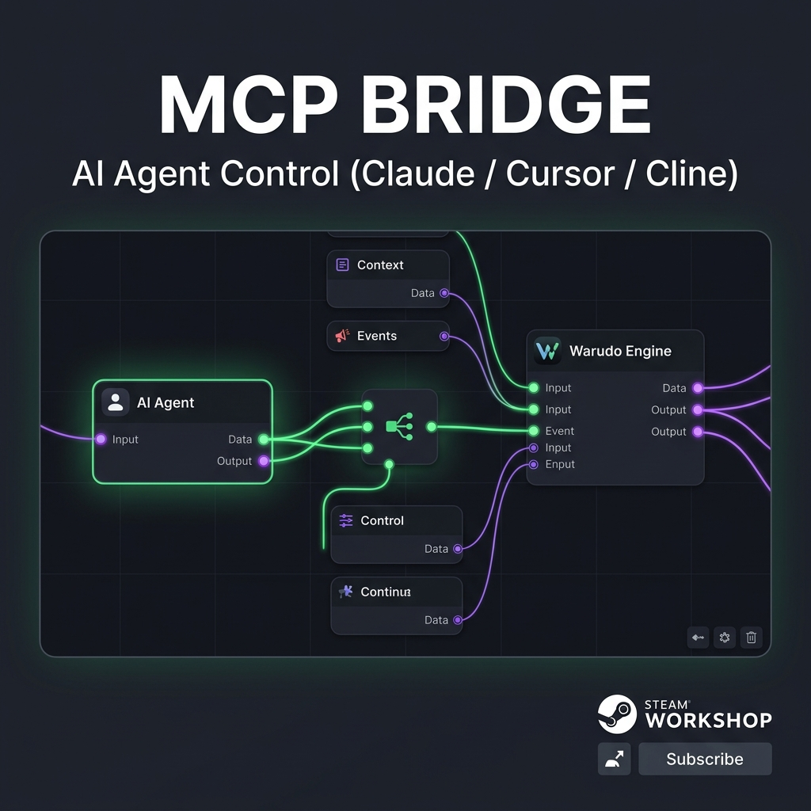

# Warudo MCP

[](https://github.com/KhoaDayy/warudo-mcp/actions/workflows/ci.yml)
[](https://nodejs.org/)
[](LICENSE)
[](docs/MIGRATION.md)
[](https://www.npmjs.com/package/warudo-mcp-server)
[](https://steamcommunity.com/sharedfiles/filedetails/?id=3809919307)

[English](README.md) · [Tiếng Việt](README.vi.md)

A Model Context Protocol (MCP) server providing standard, model-agnostic control over [Warudo](https://warudo.app/) 3D virtual production and VTubing scenes via stdio.

<p align="center">
  
</p>

---

## Overview

Controlling 3D virtual production software from Large Language Models usually requires proprietary scripts or brittle, model-specific bindings. 

**Warudo MCP** exposes Warudo's native capabilities directly to AI assistants (Claude Desktop, Cursor, Cline, Roo Code, Windsurf) through 26 strongly-typed MCP tools. The bridge operates purely on generic primitives—controlling cameras, lighting, avatar transforms, material properties, and blueprint node networks—without coupling to specific avatars or proprietary tracking setups.

### Transport Architecture

```text
MCP Host (Claude / Cursor / Cline)
       │ (JSON-RPC 2.0 over stdio)
       ▼
TypeScript MCP Server (warudo-mcp-server)
       ├── Native WebSocket API (ws://[::1]:19053) ──► Data ports, Blueprint graphs, Flow execution
       └── Bridge Plugin (ws://localhost:5678)     ──► Scene inventory, Hierarchy query, Material overrides
```

* **Native Control Plane (`:19053`)**: Interacts directly with Warudo Core for entity data ports, triggers, and full blueprint graph manipulation.
* **Bridge Plugin (`:5678`)**: A compiled, auto-starting Unity mod (`[PluginType]`) that provides deep scene inventory traversal and transient Material PropertyBlock overrides without using prohibited `System.Reflection` APIs.

---

## Features

* **Complete Scene Discovery**: Inspect all active assets, character entities, directional lights, and plugins with paginated type catalogs (`warudo_scene_inventory`, `warudo_list_assets`).
* **Autonomous Camera & Staging**: Adjust orbit offsets, rotation, field of view, and trigger screenshots dynamically.
* **Transform Protection**: Built-in serialization guard automatically double-stringifies nested `TransformData` properties (`Position`, `Rotation`, `Scale`) to prevent native deserializer corruption and late-update crash loops.
* **Blueprint Node Graph Editing**: Create, delete, rename, and enable blueprints; add and wire node pins; and invoke flow execution paths programmatically (`warudo_manage_graph`, `warudo_manage_node`, `warudo_manage_connection`, `warudo_invoke_flow`).
* **Transient Material Overrides**: Modify shader properties and material keywords at runtime using non-destructive MaterialPropertyBlocks that reset cleanly when scenes unload.
* **Explicit Execution Semantics**: Mutations that fail validation return `NOT_EXECUTED`. Unacknowledged network timeouts return `UNKNOWN` and retire the underlying socket before retrying.

---

## Requirements

* **Operating System**: Windows 10/11 (required by Warudo)
* **Node.js**: `v22.0.0` or higher
* **Warudo**: Version `0.15.0` or higher installed

---

## Quick Start (Zero Git Clone Required)

### 1. Install Warudo Plugin
Subscribe to the official mod on Steam Workshop (no Unity compilation required):
👉 [**MCP Bridge on Steam Workshop**](https://steamcommunity.com/sharedfiles/filedetails/?id=3809919307)

*Alternatively, compile `warudo-plugin/` with Warudo Mod Tools and place `Warudo-MCP.warudo` into `%APPDATA%\..\LocalLow\HakuyaLabs\Warudo\Plugins\`.*

### 2. Configure Your AI Client

#### Option A: One-Line PowerShell Installer
Open PowerShell and run:
```powershell
irm https://raw.githubusercontent.com/KhoaDayy/warudo-mcp/main/install.ps1 | iex
```
*Verifies Node.js, purges legacy Playground scripts, and configures Claude Desktop, Cursor, Cline, Roo Code, and Windsurf automatically.*

#### Option B: AI Agent Self-Setup Prompt
Copy and paste this prompt directly into your AI chat (Cursor, Claude, or Cline):
```text
Please connect to my Warudo instance via MCP:
1. Register the "warudo" MCP server in your config using command "npx" with args ["-y", "warudo-mcp-server"].
2. Remind me to subscribe to the "MCP Bridge" plugin on Steam Workshop (https://steamcommunity.com/sharedfiles/filedetails/?id=3809919307) if I haven't already.
3. Once Warudo is running with a scene open, call warudo_status to verify our live connection.
```

#### Option C: Manual Client Configuration
Add the server entry to your MCP client configuration file:

**Claude Desktop** (`%APPDATA%\Claude\claude_desktop_config.json`) or **Cursor** (`~/.cursor/mcp.json`):
```json
{
  "mcpServers": {
    "warudo": {
      "command": "npx",
      "args": ["-y", "warudo-mcp-server"]
    }
  }
}
```

---

## Tool Surface

The server exposes 26 strongly-typed tools categorized into 7 functional domains:

| Domain | Tools | Description |
|---|---|---|
| **Health** | `warudo_status`, `warudo_frame_state` | Inspect host PID, active scene, FPS, and frame counter. |
| **Scene Discovery** | `warudo_scene_inventory`, `warudo_list_assets`, `warudo_get_selected_asset`, `warudo_get_plugins`, `warudo_get_asset_types`, `warudo_get_node_types` | Enumerate scene objects, plugins, asset types, and blueprint node catalogs. |
| **Entity** | `warudo_inspect_entity`, `warudo_get_entity_port_value`, `warudo_set_entity_port_value`, `warudo_invoke_entity_trigger`, `warudo_send_plugin_message` | Read/write data ports, fire trigger buttons, and dispatch plugin messages. |
| **Blueprints** | `warudo_get_selected_graph`, `warudo_list_blueprints`, `warudo_import_graph`, `warudo_export_graph`, `warudo_set_node_data_input` | List and serialize blueprint graphs; import with `dryRun` validation. |
| **Graph Editing** | `warudo_manage_graph`, `warudo_manage_node`, `warudo_manage_connection`, `warudo_invoke_flow` | Create/remove/rename graphs, manage nodes, wire pins, and trigger flow inputs. |
| **Unity Runtime** | `warudo_list_hierarchy`, `warudo_set_gameobject_active`, `warudo_set_material_property` | Traverse GameObject hierarchy, toggle objects, and apply material properties. |
| **Compatibility** | `warudo_api` | Raw passthrough for native Warudo actions not covered by typed tools. |

### Value Formatting & Validation

Port setters support explicit typed prefixes:
* Primitives: `float:0.5`, `int:42`, `bool:true`, `string:hello`
* Vectors: `vector3:0,1.5,-2`
* Colors: `color:#ff00ffff` or `color:1,0,1,1` (uniform 0–1 or 0–255 scale)
* JSON / Structured: `json:{"value": 2}`

---

## Configuration

| Environment Variable | Default Value | Description |
|---|---|---|
| `WARUDO_API_WS_URL` | `ws://[::1]:19053/` | Full WebSocket URL for Warudo Native API (overrides host/port). |
| `WARUDO_API_WS_HOST` / `WARUDO_API_WS_PORT` | `::1` / `19053` | Host and port for Warudo Native API. |
| `WARUDO_WS_URL` | `ws://localhost:5678/` | Full WebSocket URL for compiled C# MCP Bridge plugin. |
| `WARUDO_WS_HOST` / `WARUDO_WS_PORT` | `localhost` / `5678` | Host and port for C# MCP Bridge plugin. |
| `WARUDO_API_TOKEN` | *(Auto-discovered)* | 32-character hexadecimal auth token. Discovered automatically from `Player.log`. |

---

## Project Structure

```txt
warudo-mcp/
├── .github/workflows/ci.yml       # Multi-platform CI (Ubuntu & Windows)
├── docs/
│   ├── MIGRATION.md               # Upgrading from v0.1/v0.2 to v0.3 protocol v2
│   └── VERIFICATION.md            # Automated testing & live acceptance matrix
├── install.ps1                    # One-line automated PowerShell installer
├── mcp-server/                    # TypeScript MCP Server package
│   ├── src/
│   │   ├── tools/                 # Modular tool schemas (entities, graphs, runtime)
│   │   ├── server.ts              # MCP server factory with dependency injection
│   │   ├── values.ts              # Value validation & TransformData safety wrapper
│   │   ├── warudoApi.ts           # Native WebSocket client (:19053)
│   │   └── warudoBridge.ts        # Protocol v2 Bridge client (:5678)
│   └── tests/                     # Automated test suite (37 tests)
└── warudo-plugin/                 # C# Unity Plugin sources (UMod / .NET Framework)
    ├── McpBridgePlugin.cs         # Auto-starting [PluginType] lifecycle
    ├── McpBridgeService.cs        # WebSocketSharp RPC service
    ├── GameObjectPathResolver.cs  # Reflection-free hierarchy resolver
    └── MaterialKeywordOverrideStore.cs # Transient material PropertyBlock manager
```

---

## Development

Clone the repository and install dependencies:

```powershell
git clone https://github.com/KhoaDayy/warudo-mcp.git
cd warudo-mcp/mcp-server
npm ci
npm run build
```

### Local Commands

```powershell
npm run dev             # Run development server with tsx
npm run typecheck       # Verify TypeScript types without emitting
npm test                # Execute Node.js automated test runner (37 tests)
npm run check           # Run typecheck, tests, and npm pack allowlist verification
```

### Plugin Verification

To compile the C# plugin sources against your local Warudo installation:

```powershell
powershell -NoProfile -File scripts/check-bridge.ps1
```

---

## Documentation

* [Migration Guide](docs/MIGRATION.md): Breaking changes from earlier versions and node retirement records.
* [Verification Record](docs/VERIFICATION.md): Test harness details, limits, response budgets, and live acceptance checklist.
* [Refactor Plan](REFACTOR_PLAN.md): Architectural decisions and scope audit history.

---

## License

This project is licensed under the [MIT License](LICENSE).

### Acknowledgements

* [Warudo](https://warudo.app/) by Hakuya Labs.
* [Model Context Protocol](https://modelcontextprotocol.io/) by Anthropic.
* Upstream architectural insights from `StudioRaming/warudo-agent-bridge` and `esprite-VTOKU/WarudoMCP`.
